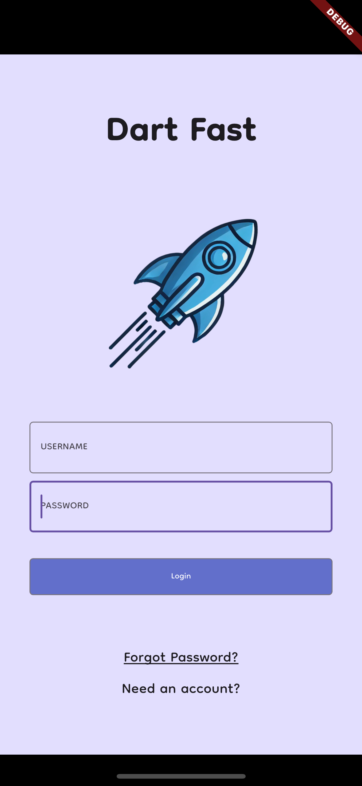

# dart_fast

Eine kleine App, mit der man Dart üben kann.

Projektblätter wurden anhand dieser App live in der Vorlesung gecoded.

## Idee

Dem Benutzer sollen Aufgaben gezeigt werden, die er lösen muss.
Dabei kann es verschiedene Aufgaben geben, zum Beispiel Multiple Choice oder Freitext.

Der Benutzer soll eine Übersicht über die von ihm gelösten Aufgaben haben, um seinen Fortschritt zu checken.

## App starten

Möglicherweise muss `flutter pub get` im Terminal ausgeführt werden oder `Flutter: Get Packages` in Visual Studio Code.

## Icons + Splash Screen neu generieren

`dart run flutter_launcher_icons`
`dart run flutter_native_splash:create`

## Screenshots

Login Screen                       |  Quiz Screen         
:--------------------------------:|:-------------------------:
{width=150}  |  {width=150} 